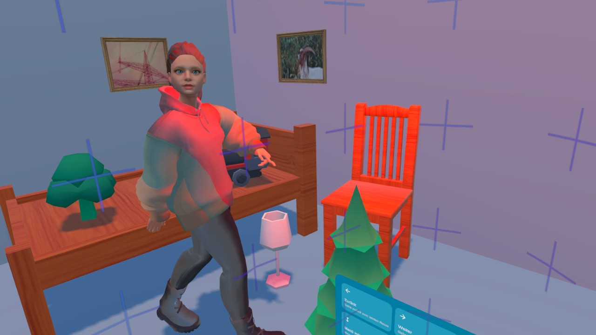

# MR-MiRA-Method-of-Loci-App

## Installation
1. Clone the repository
2. Install Unity Hub and Unity Editor version 6000.0.31f1 with "Android Build Support" module
3. Packages should install automatically, when opening the project, if not, install the following packages via the package manager (`Window` -> `Package Manager`):
    - [Virtual Agents Framework](https://github.com/rwth-acis/Virtual-Agents-Framework?tab=readme-ov-file#setup)
    - [i5 Toolkit for Unity](https://github.com/rwth-acis/i5-Toolkit-for-Unity?tab=readme-ov-file#setup)
    - Meta XR All-in-One SDK
    - Runtime Preview generator
    - (optionally, to import character models) Ready Player Me Core
4. Change the build platform to Android (`File` -> `Build Profiles` -> `Android™` -> `Switch Platform`)

## Audio Credits
airhockey.mp3 by morgantj -- https://freesound.org/s/59573/ -- License: Attribution 4.0
Shovel_hitting_hard_dirt_1.wav by Glen_Dorner -- https://freesound.org/s/654112/ -- License: Attribution 4.0

## Icon Credits
Material Symbols are available under the [Apache License Version 2.0](https://www.apache.org/licenses/LICENSE-2.0.html).